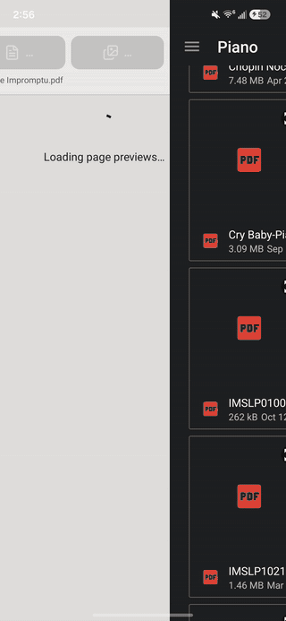

# Rescore

Read piano sheet music on a phone. Rescore takes a PDF, a scan or photos of a score and splits each page into one strip per line of music. It then shows those strips full-width, a few at a time, so the notes stay large enough to read at the piano. Everything runs on the device, with no upload and no server.

<!-- TODO: add a short GIF of a page turning into strips, e.g. docs/demo.gif

-->

## Features

- **Import:** PDFs (choose which pages to use, and reorder them) or photos from the gallery.
- **Automatic slicing:** each line of music becomes its own strip. For piano, a line is a *system*: the treble and bass staves joined by a brace, which always stay together.
- **Reader:** tap or swipe to turn. You set how many strips show at once, separately for portrait and landscape. The reader has a dark mode and keeps the screen awake while you read.
- **Corrections:** merge a strip with the one above, split a strip at movable cut lines with adjustable overlap, or delete a strip to a restorable garbage bin.
- **Library:** scores save automatically and reopen from the library or the recent list.

## How it works

```text
PDF page / photo
  → rendered to grayscale natively (PdfRenderer on Android, PDFKit on iOS)
  → C++ slicer (shared by both platforms) finds each system's brace, then places strip edges
  → strips encoded as PNGs natively; only file paths and sizes reach JavaScript
  → React Native reader
```

The slicer lives in [`modules/piano-pdf-parser/cpp`](modules/piano-pdf-parser/cpp). It binarizes each page, finds the thin vertical brace to the left of each system, and grows a strip around it. Pages without braces fall back to a row-profile method. Strip edges are placed on rows that no ink crosses where possible. Short lines of marks, such as pedal signs, dynamics or tempo words, go with the nearer system. Neighbouring strips overlap on purpose, so notation that crosses a boundary is still readable.

## Results

These were measured with the benchmark in [`cpp/tools/bench`](modules/piano-pdf-parser/cpp/tools/bench). It uses 244 pages from 31 scores, from modern engravings to 19th-century scans.

| | Result |
|---|---|
| Lines of music found correctly (93-page graded set) | 99.3% (408 of 411) |
| Notation at a strip edge still shown whole (landscape view) | 92%, up from 59% before edge snapping |
| Slicing time per page, Galaxy S24 | about 40 ms (median) |

The benchmark README explains the method, its limits, and how to rerun it.

## Build and run

This app uses a custom native module, so **Expo Go will not work**. You need a development build.

Requirements: Node.js 18+, plus Android Studio for Android or Xcode for iOS. Only the Android build has been tested so far.

```sh
npm install

# development build with Metro
npm run prebuild:dev
npx expo run:android
npm start

# standalone release APK
npm run build:apk
adb install -r dist/rescore-release.apk
```

After a release build, run `npm run prebuild:dev` again before going back to Metro development. Adding a native dependency always needs a native rebuild (`npx expo run:android`); reloading Metro isn't enough.

### Slicer tests and benchmark

```sh
cd modules/piano-pdf-parser/cpp
cmake -S . -B build -DCMAKE_BUILD_TYPE=Release && cmake --build build
./build/slicer_test

python3 tools/bench/run.py   # needs PyMuPDF and a folder of score PDFs (default ~/Piano)
```

## Picking a PDF on Android

The system picker opens on **Recents**. Use the **☰** menu to reach Downloads or other folders. The internal storage root often looks empty, which is normal. The picker accepts any file type, and the app checks for a PDF itself, because MIME filters can hide files downloaded from IMSLP.

## Project layout

| Path | What's there |
|---|---|
| `app/`, `components/`, `lib/` | React Native screens, reader components, library and corrections logic |
| `modules/piano-pdf-parser/android`, `ios` | Native rendering, PNG encoding and the bridge to the slicer |
| `modules/piano-pdf-parser/cpp` | C++ slicer, unit tests, debug tools and the benchmark |
| `assets/icon-src` | SVG sources for the app icon (`bash build.sh` regenerates the PNGs) |
| `scripts/build-release-apk.mjs` | Release APK build without the dev client |
